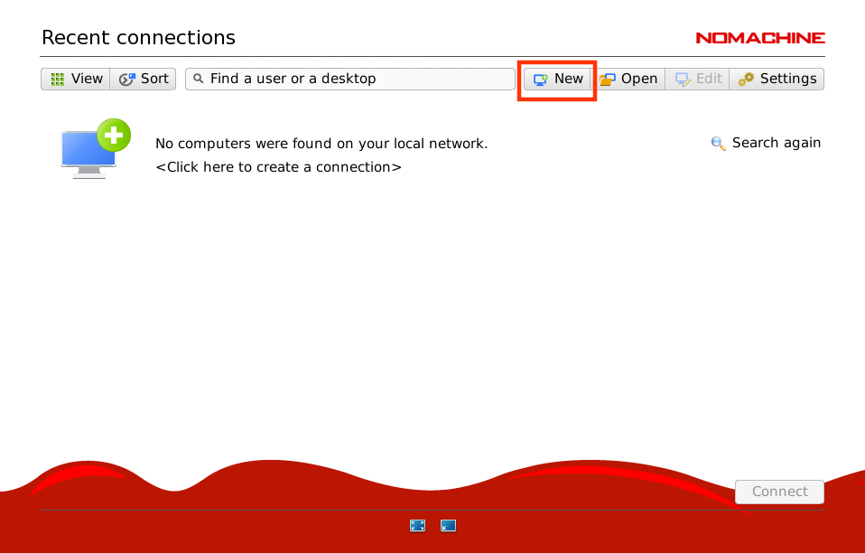

## Setting up Remote desktop for CentOS 7.5 Based linux on Azure

RDP Being proproetory protocol from microsoft, is much slower on linux desktops. Linux have native remote desktop protocols like NX which are supported on Windows. You can install NoMachine (Client) on windows and NoMachine (Server) on Linux desktop. Open port `4000` and connect!

## Setting up NoMachine on CentOS 7.5 (Azure VM)

1.  Create new CentOS 7.5 Based linux VM and keep port 22 open for SSH access.

2.  Open additional port `4000` with name "NX_PORT".
    

2.  Once VM is UP and RUNNING connect using SSH
3.  Once, SSH connection is active, use following commands to install gnome desktop and then install nomachine.

    ```bash
    # Update your Base OS packages (Recommanded)
    $ sudo yum update -y
    # Install Gnome Desktop
    $ sudo yum group install "GNOME Desktop" -y
    # Download the NoMachine package for CentOS 7.x / RHEL 6.x
    $ wget https://download.nomachine.com/download/6.7/Linux/nomachine_6.7.6_11_x86_64.rpm
    # Install the package
    $ sudo yum install -y nomachine_6.7.6_11_x86_64.rpm
    $ sudo reboot
    ```

4.  Wait for couple of minutes for Guest VM to reboot.

5.  Now, install NoMachine on your windows system. Visit URL: https://www.nomachine.com/download/download&id=8 

6.  Install NoMachine on Windows (Just accept all defaults in installation).

7.  Once, NoMachine is installed, restart your windows system.

8.  After restart, Open NoMachine from start menu and click "New" connection. 
9.  For "New" connection use following settings:
    ```yaml
    Host:   <Public-IP-for-VM>
    Port:   NX
    Authentication: Password
    User:   <VM-Username>
    Password: <VM-Password>
    ```

    

    

    

    

    

    

    

    

    

    Accept all other prompts after this step.
